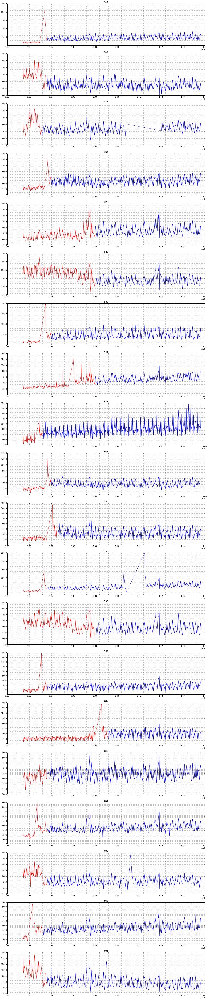

# Rossmann Store Sales

With this script you could have achieved the 13th place in the Rossmann Store Sales competition on Kaggle. No external data is used.

If you would add Google Trends daily searches for 'Rossmann', State data and Weather data per State, you can get to the 7th place with just one model. But because that model would be useless for real world usage, that data is kept out of this model.

This script uses about 8Gb of RAM and takes some hour to run.


```python
import numpy as np
import pandas as pd
import matplotlib.pyplot as plt
import xgboost as xgb

import pylab
import csv
import datetime
import math
import re
import time
import random
import os

from pandas.tseries.offsets import *
from operator import *

from sklearn.cross_validation import train_test_split

%matplotlib inline

# plt.style.use('ggplot') # Good looking plots

np.set_printoptions(precision=4, threshold=10000, linewidth=100, edgeitems=999, suppress=True)

pd.set_option('display.max_columns', None)
pd.set_option('display.max_rows', None)
pd.set_option('display.width', 100)
pd.set_option('expand_frame_repr', False)
pd.set_option('precision', 6)

start_time = time.time()
```


```python
# Thanks to Chenglong Chen for providing this in the forum
def ToWeight(y):
    w = np.zeros(y.shape, dtype=float)
    ind = y != 0
    w[ind] = 1./(y[ind]**2)
    return w

def rmspe(yhat, y):
    w = ToWeight(y)
    rmspe = np.sqrt(np.mean( w * (y - yhat)**2 ))
    return rmspe

def rmspe_xg(yhat, y):
    # y = y.values
    y = y.get_label()
    y = np.exp(y) - 1
    yhat = np.exp(yhat) - 1
    w = ToWeight(y)
    rmspe = np.sqrt(np.mean(w * (y - yhat)**2))
    return "rmspe", rmspe
```

## Setting seed


```python
seed = 42
```

## Reading sales data


```python
nrows = None

df_train = pd.read_csv('../data/train.csv', 
                       nrows=nrows,
                       parse_dates=['Date'],
                       date_parser=(lambda dt: pd.to_datetime(dt, format='%Y-%m-%d')))

nrows = nrows

df_submit = pd.read_csv('../data/test.csv', 
                        nrows=nrows,
                        parse_dates=['Date'],
                        date_parser=(lambda dt: pd.to_datetime(dt, format='%Y-%m-%d')))
```

    C:\Anaconda\lib\site-packages\IPython\core\interactiveshell.py:2902: DtypeWarning: Columns (7) have mixed types. Specify dtype option on import or set low_memory=False.
      interactivity=interactivity, compiler=compiler, result=result)
    


```python
### Setting a variable to easily distinguish train (1) from submit (0) set
df_train['Set'] = 1
df_submit['Set'] = 0
```


```python
### Combine train and test set
frames = [df_train, df_submit]
df = pd.concat(frames)
```


```python
df.info()
```

    <class 'pandas.core.frame.DataFrame'>
    Int64Index: 1058297 entries, 0 to 41087
    Data columns (total 11 columns):
    Customers        1017209 non-null float64
    Date             1058297 non-null datetime64[ns]
    DayOfWeek        1058297 non-null int64
    Id               41088 non-null float64
    Open             1058286 non-null float64
    Promo            1058297 non-null int64
    Sales            1017209 non-null float64
    SchoolHoliday    1058297 non-null int64
    Set              1058297 non-null int64
    StateHoliday     1058297 non-null object
    Store            1058297 non-null int64
    dtypes: datetime64[ns](1), float64(4), int64(5), object(1)
    memory usage: 96.9+ MB
    


```python
features_x = ['Store', 'Date', 'DayOfWeek', 'Open', 'Promo', 'SchoolHoliday', 'StateHoliday']
features_y = ['SalesLog']
```


```python
### Remove rows where store is open, but no sales.
df = df.loc[~((df['Open'] == 1) & (df['Sales'] == 0))]
```


```python
df.loc[df['Set'] == 1, 'SalesLog'] = np.log1p(df.loc[df['Set'] == 1]['Sales']) # = np.log(df['Sales'] + 1)
```


```python
df['StateHoliday'] = df['StateHoliday'].astype('category').cat.codes
```


```python
var_name = 'Date'

df[var_name + 'Day'] = pd.Index(df[var_name]).day
df[var_name + 'Week'] = pd.Index(df[var_name]).week
df[var_name + 'Month'] = pd.Index(df[var_name]).month
df[var_name + 'Year'] = pd.Index(df[var_name]).year
df[var_name + 'DayOfYear'] = pd.Index(df[var_name]).dayofyear

df[var_name + 'Day'] = df[var_name + 'Day'].fillna(0)
df[var_name + 'Week'] = df[var_name + 'Week'].fillna(0)
df[var_name + 'Month'] = df[var_name + 'Month'].fillna(0)
df[var_name + 'Year'] = df[var_name + 'Year'].fillna(0)
df[var_name + 'DayOfYear'] = df[var_name + 'DayOfYear'].fillna(0)

features_x.remove(var_name)
features_x.append(var_name + 'Day')
features_x.append(var_name + 'Week')
features_x.append(var_name + 'Month')
features_x.append(var_name + 'Year')
features_x.append(var_name + 'DayOfYear')
```


```python
df['DateInt'] = df['Date'].astype(np.int64)
```

## Reading store data


```python
df_store = pd.read_csv('../data/store.csv', 
                       nrows=nrows)
```


```python
df_store.info()
```

    <class 'pandas.core.frame.DataFrame'>
    Int64Index: 1115 entries, 0 to 1114
    Data columns (total 10 columns):
    Store                        1115 non-null int64
    StoreType                    1115 non-null object
    Assortment                   1115 non-null object
    CompetitionDistance          1112 non-null float64
    CompetitionOpenSinceMonth    761 non-null float64
    CompetitionOpenSinceYear     761 non-null float64
    Promo2                       1115 non-null int64
    Promo2SinceWeek              571 non-null float64
    Promo2SinceYear              571 non-null float64
    PromoInterval                571 non-null object
    dtypes: float64(5), int64(2), object(3)
    memory usage: 95.8+ KB
    


```python
### Convert Storetype and Assortment to numerical categories
df_store['StoreType'] = df_store['StoreType'].astype('category').cat.codes
df_store['Assortment'] = df_store['Assortment'].astype('category').cat.codes
```


```python
### Convert competition open year and month to float
def convertCompetitionOpen(df):
    try:
        date = '{}-{}'.format(int(df['CompetitionOpenSinceYear']), int(df['CompetitionOpenSinceMonth']))
        return pd.to_datetime(date)
    except:
        return np.nan

df_store['CompetitionOpenInt'] = df_store.apply(lambda df: convertCompetitionOpen(df), axis=1).astype(np.int64)
```


```python
### Convert competition open year and month to float
def convertPromo2(df):
    try:
        date = '{}{}1'.format(int(df['Promo2SinceYear']), int(df['Promo2SinceWeek']))
        return pd.to_datetime(date, format='%Y%W%w')
    except:
        return np.nan

df_store['Promo2SinceFloat'] = df_store.apply(lambda df: convertPromo2(df), axis=1).astype(np.int64)
```


```python
s = df_store['PromoInterval'].str.split(',').apply(pd.Series, 1)
s.columns = ['PromoInterval0', 'PromoInterval1', 'PromoInterval2', 'PromoInterval3']
df_store = df_store.join(s)
```


```python
def monthToNum(date):
    return{
            'Jan' : 1,
            'Feb' : 2,
            'Mar' : 3,
            'Apr' : 4,
            'May' : 5,
            'Jun' : 6,
            'Jul' : 7,
            'Aug' : 8,
            'Sept' : 9, 
            'Oct' : 10,
            'Nov' : 11,
            'Dec' : 12
    }[date]

df_store['PromoInterval0'] = df_store['PromoInterval0'].map(lambda x: monthToNum(x) if str(x) != 'nan' else np.nan)
df_store['PromoInterval1'] = df_store['PromoInterval1'].map(lambda x: monthToNum(x) if str(x) != 'nan' else np.nan)
df_store['PromoInterval2'] = df_store['PromoInterval2'].map(lambda x: monthToNum(x) if str(x) != 'nan' else np.nan)
df_store['PromoInterval3'] = df_store['PromoInterval3'].map(lambda x: monthToNum(x) if str(x) != 'nan' else np.nan)
```


```python
del df_store['PromoInterval']
```


```python
store_features = ['Store', 'StoreType', 'Assortment', 
                  'CompetitionDistance', 'CompetitionOpenInt',
                  'PromoInterval0']

### Features not helping
# PromoInterval1, PromoInterval2, PromoInterval3

features_x = list(set(features_x + store_features))
```


```python
df = pd.merge(df, df_store[store_features], how='left', on=['Store'])
```


```python
### Convert every NAN to -1
for feature in features_x:
    df[feature] = df[feature].fillna(-1)
```

## Manually Check and Correct some Strange Data in Stores


```python
list_stores_to_check = [105,163,172,364,378,523,589,663,676,681,700,708,730,764,837,845,861,882,969,986]

plt.rcParams["figure.figsize"] = [20,len(list_stores_to_check)*5]

j = 1
for i in list_stores_to_check:
    stor = i

    # Normal sales
    X1 = df.loc[(df['Set'] == 1) & (df['Store'] == stor) & (df['Open'] == 1)]
    y1 = df.loc[(df['Set'] == 1) & (df['Store'] == stor) & (df['Open'] == 1)]['Sales']

    Xt = df.loc[(df['Store'] == stor)]
    
    plt.subplot(len(list_stores_to_check),1,j)
    plt.plot(X1['DateInt'], y1, '-')
    plt.minorticks_on()
    plt.grid(True, which='both')
    plt.title(i)
    j += 1
```


```python
list_stores_to_check = [192,263,500,797,815,825]

plt.rcParams["figure.figsize"] = [20,len(list_stores_to_check)*5]

j = 1
for i in list_stores_to_check:
    stor = i

    # Normal sales
    X1 = df.loc[(df['Set'] == 1) & (df['Store'] == stor) & (df['Open'] == 1)]
    y1 = df.loc[(df['Set'] == 1) & (df['Store'] == stor) & (df['Open'] == 1)]['Sales']

    Xt = df.loc[(df['Store'] == stor)]
    
    plt.subplot(len(list_stores_to_check),1,j)
    plt.plot(X1['DateInt'], y1, '-')
    plt.minorticks_on()
    plt.grid(True, which='both')
    plt.title(i)
    j += 1
```


```python
list_stores_to_check = [274,524,709,1029]

plt.rcParams["figure.figsize"] = [20,len(list_stores_to_check)*5]

j = 1
for i in list_stores_to_check:
    stor = i

    # Normal sales
    X1 = df.loc[(df['Set'] == 1) & (df['Store'] == stor)]
    y1 = df.loc[(df['Set'] == 1) & (df['Store'] == stor)]['Sales']

    Xt = df.loc[(df['Store'] == stor)]
    
    plt.subplot(len(list_stores_to_check),1,j)
    plt.plot(X1['DateInt'], y1, '.')
    plt.minorticks_on()
    plt.grid(True, which='both')
    plt.title(i)
    j += 1
```


```python
list_stores_to_check = [274,524,709,1029]

plt.rcParams["figure.figsize"] = [20,len(list_stores_to_check)*5]

j = 1
for i in list_stores_to_check:
    stor = i

    # Normal sales
    X1 = df.loc[(df['Set'] == 1) & (df['Store'] == stor) & (df['Open'] == 1)]
    y1 = df.loc[(df['Set'] == 1) & (df['Store'] == stor) & (df['Open'] == 1)]['Sales']

    Xt = df.loc[(df['Store'] == stor)]
    
    plt.subplot(len(list_stores_to_check),1,j)
    plt.plot(X1['DateInt'], y1, '-')
    plt.minorticks_on()
    plt.grid(True, which='both')
    plt.title(i)
    j += 1
```


```python
list_stores_to_check = [299,453,530,732,931]

plt.rcParams["figure.figsize"] = [20,len(list_stores_to_check)*5]

j = 1
for i in list_stores_to_check:
    stor = i

    # Normal sales
    X1 = df.loc[(df['Set'] == 1) & (df['Store'] == stor) & (df['Open'] == 1)]
    y1 = df.loc[(df['Set'] == 1) & (df['Store'] == stor) & (df['Open'] == 1)]['Sales']

    Xt = df.loc[(df['Store'] == stor)]
    
    plt.subplot(len(list_stores_to_check),1,j)
    plt.plot(X1['DateInt'], y1, '-')
    plt.minorticks_on()
    plt.grid(True, which='both')
    plt.title(i)
    j += 1
```


```python
store_dates_to_remove = {   105:1.368e18, 163:1.368e18,
                            172:1.366e18, 364:1.37e18,
                            378:1.39e18, 523:1.39e18,
                            589:1.37e18, 663:1.39e18,
                            676:1.366e18, 681:1.37e18,
                            700:1.373e18, 708:1.368e18,
                            709:1.423e18, 730:1.39e18,
                            764:1.368e18, 837:1.396e18,
                            845:1.368e18, 861:1.368e18,
                            882:1.368e18, 969:1.366e18,
                            986:1.368e18, 192:1.421e18,
                            263:1.421e18, 500:1.421e18,
                            797:1.421e18, 815:1.421e18,
                            825:1.421e18}

for key,value in store_dates_to_remove.iteritems():
    df.loc[(df['Store'] == key) & (df['DateInt'] < value), 'Delete'] = True
```


```python
list_stores_to_check = [105,163,172,364,378,523,589,663,676,681,700,708,730,764,837,845,861,882,969,986]

plt.rcParams["figure.figsize"] = [20,len(list_stores_to_check)*5]

j = 1
for i in list_stores_to_check:
    stor = i

    # Normal sales
    X1 = df.loc[(df['Set'] == 1) & (df['Store'] == stor) & (df['Open'] == 1) & (df['Delete'] == True)]
    y1 = df.loc[(df['Set'] == 1) & (df['Store'] == stor) & (df['Open'] == 1) & (df['Delete'] == True)]['Sales']
    
    X2 = df.loc[(df['Set'] == 1) & (df['Store'] == stor) & (df['Open'] == 1) & (df['Delete'] != True)]
    y2 = df.loc[(df['Set'] == 1) & (df['Store'] == stor) & (df['Open'] == 1) & (df['Delete'] != True)]['Sales']

    Xt = df.loc[(df['Store'] == stor)]
    
    plt.subplot(len(list_stores_to_check),1,j)
    plt.plot(X1['DateInt'], y1, 'r-')
    plt.plot(X2['DateInt'], y2, '-')
    plt.minorticks_on()
    plt.grid(True, which='both')
    plt.title(i)
    j += 1
```





```python
### Delete the data where sales in the first period is much different from the rest
df = df.loc[df['Delete'] != True]
```

## Remove Outliers with Deviation >= 3


```python
def mad_based_outlier(points, thresh=3.5):
    if len(points.shape) == 1:
        points = points[:,None]
    median = np.median(points, axis=0)
    diff = np.sum((points - median)**2, axis=-1)
    diff = np.sqrt(diff)
    med_abs_deviation = np.median(diff)

    modified_z_score = 0.6745 * diff / med_abs_deviation

    return modified_z_score > thresh
```


```python
for i in df['Store'].unique():
    df.loc[(df['Set'] == 1) & (df['Store'] == i) & (df['Open'] == 1), 'Outlier'] = \
        mad_based_outlier(df.loc[(df['Set'] == 1) & (df['Store'] == i) & (df['Open'] == 1)]['Sales'], 3)
```


```python
no_stores_to_check = 10

plt.rcParams["figure.figsize"] = [20,no_stores_to_check*5]

for i in range(1,no_stores_to_check+1):
    stor = i

    # Normal sales
    X1 = df.loc[(df['Set'] == 1) & (df['Store'] == stor) & (df['Open'] == 1) & (df['Outlier'] == False)]
    y1 = df.loc[(df['Set'] == 1) & (df['Store'] == stor) & (df['Open'] == 1) & (df['Outlier'] == False)]['Sales']

    # Outliers
    X2 = df.loc[(df['Set'] == 1) & (df['Store'] == stor) & (df['Open'] == 1) & (df['Outlier'] == True)]
    y2 = df.loc[(df['Set'] == 1) & (df['Store'] == stor) & (df['Open'] == 1) & (df['Outlier'] == True)]['Sales']

    Xt = df.loc[(df['Store'] == stor)]
    
    plt.subplot(10,5,i)
    plt.plot(X1['Date'], y1, '-')
    plt.plot(X2['Date'], y2, 'r.')
    plt.title(i)
    plt.axis('off')
```


## Split Data in Training and Test for Filling in the Outliers


```python
X_train, X_test, y_train, y_test = train_test_split(df.loc[(df['Set'] == 1) & (df['Open'] == 1) & (df['Outlier'] == False)][features_x],
                                                    df.loc[(df['Set'] == 1) & (df['Open'] == 1) & (df['Outlier'] == False)][features_y],
                                                    test_size=0.1, random_state=seed)
```


```python
dtrain = xgb.DMatrix(X_train, y_train)
dtest = xgb.DMatrix(X_test, y_test)
```


```python
num_round = 20000
evallist = [(dtrain, 'train'), (dtest, 'test')]
```


```python
param = {'bst:max_depth':12,
         'bst:eta':0.01,
         'subsample':0.8,
         'colsample_bytree':0.7,
         'silent':1,
         'objective':'reg:linear',
         'nthread':6,
         'seed':seed}

plst = param.items()

bst = xgb.train(plst, dtrain, num_round, evallist, feval=rmspe_xg, verbose_eval=250, early_stopping_rounds=250)
```

    Will train until test error hasn't decreased in 250 rounds.
    [0]	train-rmspe:0.999863	test-rmspe:0.999863
    [250]	train-rmspe:0.491216	test-rmspe:0.487971
    [500]	train-rmspe:0.198972	test-rmspe:0.188309
    [750]	train-rmspe:0.166821	test-rmspe:0.156818
    [1000]	train-rmspe:0.137129	test-rmspe:0.132996
    [1250]	train-rmspe:0.122311	test-rmspe:0.121035
    [1500]	train-rmspe:0.109952	test-rmspe:0.112465
    [1750]	train-rmspe:0.100481	test-rmspe:0.106788
    [2000]	train-rmspe:0.093883	test-rmspe:0.102796
    [2250]	train-rmspe:0.088570	test-rmspe:0.100460
    [2500]	train-rmspe:0.083871	test-rmspe:0.098587
    [2750]	train-rmspe:0.080263	test-rmspe:0.097114
    [3000]	train-rmspe:0.077273	test-rmspe:0.095896
    [3250]	train-rmspe:0.074326	test-rmspe:0.094886
    [3500]	train-rmspe:0.071833	test-rmspe:0.094089
    [3750]	train-rmspe:0.069701	test-rmspe:0.093385
    [4000]	train-rmspe:0.067834	test-rmspe:0.092811
    [4250]	train-rmspe:0.066103	test-rmspe:0.092347
    [4500]	train-rmspe:0.064509	test-rmspe:0.091941
    [4750]	train-rmspe:0.062960	test-rmspe:0.091569
    [5000]	train-rmspe:0.061581	test-rmspe:0.091271
    [5250]	train-rmspe:0.060224	test-rmspe:0.091016
    [5500]	train-rmspe:0.058971	test-rmspe:0.090792
    [5750]	train-rmspe:0.057782	test-rmspe:0.090605
    [6000]	train-rmspe:0.056656	test-rmspe:0.090459
    [6250]	train-rmspe:0.055568	test-rmspe:0.090350
    [6500]	train-rmspe:0.054547	test-rmspe:0.090252
    [6750]	train-rmspe:0.053527	test-rmspe:0.090143
    [7000]	train-rmspe:0.052577	test-rmspe:0.090067
    [7250]	train-rmspe:0.051698	test-rmspe:0.090008
    [7500]	train-rmspe:0.050825	test-rmspe:0.089956
    [7750]	train-rmspe:0.050012	test-rmspe:0.089897
    [8000]	train-rmspe:0.049207	test-rmspe:0.089844
    [8250]	train-rmspe:0.048413	test-rmspe:0.089800
    [8500]	train-rmspe:0.047679	test-rmspe:0.089768
    [8750]	train-rmspe:0.046973	test-rmspe:0.089742
    [9000]	train-rmspe:0.046274	test-rmspe:0.089741
    Stopping. Best iteration:
    [8751]	train-rmspe:0.046970	test-rmspe:0.089741
    
    


```python
dpred = xgb.DMatrix(df.loc[(df['Set'] == 1) & (df['Open'] == 1) & (df['Outlier'] == True)][features_x])
```


```python
ypred_bst = bst.predict(dpred)
```


```python
df.loc[(df['Set'] == 1) & (df['Open'] == 1) & (df['Outlier'] == True), 'SalesLog'] = ypred_bst
df.loc[(df['Set'] == 1) & (df['Open'] == 1) & (df['Outlier'] == True), 'Sales'] = np.exp(ypred_bst) - 1
```


```python
### You see the result being lower than before, but most of them are still pretty high
no_stores_to_check = 10

plt.rcParams["figure.figsize"] = [20,no_stores_to_check*5]

for i in range(1,no_stores_to_check+1):
    stor = i

    # Normal sales
    X1 = df.loc[(df['Set'] == 1) & (df['Store'] == stor) & (df['Open'] == 1) & (df['Outlier'] == False)]
    y1 = df.loc[(df['Set'] == 1) & (df['Store'] == stor) & (df['Open'] == 1) & (df['Outlier'] == False)]['Sales']

    # Outliers
    X2 = df.loc[(df['Set'] == 1) & (df['Store'] == stor) & (df['Open'] == 1) & (df['Outlier'] == True)]
    y2 = df.loc[(df['Set'] == 1) & (df['Store'] == stor) & (df['Open'] == 1) & (df['Outlier'] == True)]['Sales']

    Xt = df.loc[(df['Store'] == stor)]
    
    plt.subplot(10,5,i)
    plt.plot(X1['Date'], y1, '-')
    plt.plot(X2['Date'], y2, 'r.')
    plt.title(i)
    plt.axis('off')
```


## Generating some extra store data from sales


```python
### Get total sales, customers and open days per store
store_data_sales = df.groupby([df['Store']])['Sales'].sum()
store_data_customers = df.groupby([df['Store']])['Customers'].sum()
store_data_open = df.groupby([df['Store']])['Open'].count()
```


```python
### Calculate sales per day, customers per day and sales per customers per day
store_data_sales_per_day = store_data_sales / store_data_open
store_data_customers_per_day = store_data_customers / store_data_open
store_data_sales_per_customer_per_day = store_data_sales_per_day / store_data_customers_per_day
```


```python
df_store = pd.merge(df_store, store_data_sales_per_day.reset_index(name='SalesPerDay'), how='left', on=['Store'])
df_store = pd.merge(df_store, store_data_customers_per_day.reset_index(name='CustomersPerDay'), how='left', on=['Store'])
df_store = pd.merge(df_store, store_data_sales_per_customer_per_day.reset_index(name='SalesPerCustomersPerDay'), how='left', on=['Store'])
```


```python
store_features = ['Store', 'SalesPerDay', 'CustomersPerDay', 'SalesPerCustomersPerDay']

features_x = list(set(features_x + store_features))
```


```python
df = pd.merge(df, df_store[store_features], how='left', on=['Store'])
```

## Random Sampling


```python
X_train, X_test, y_train, y_test = train_test_split(df.loc[(df['Set'] == 1) & (df['Open'] == 1)][features_x],
                                                    df.loc[(df['Set'] == 1) & (df['Open'] == 1)][features_y],
                                                    test_size=0.1, random_state=seed)
```


```python
dtrain = xgb.DMatrix(X_train, y_train)
dtest = xgb.DMatrix(X_test, y_test)
```


```python
num_round = 20000
evallist = [(dtrain, 'train'), (dtest, 'test')]
```


```python
param = {'bst:max_depth':12,
         'bst:eta':0.0095,
         'subsample':0.8,
         'colsample_bytree':0.7,
         'silent':1, 
         'objective':'reg:linear',
         'nthread':6,
         'seed':seed}

plst = param.items()

bst1 = xgb.train(plst, dtrain, num_round, evallist, feval=rmspe_xg, verbose_eval=250, early_stopping_rounds=250)
```

    Will train until test error hasn't decreased in 250 rounds.
    [0]	train-rmspe:0.999866	test-rmspe:0.999865
    [250]	train-rmspe:0.531137	test-rmspe:0.529227
    [500]	train-rmspe:0.137918	test-rmspe:0.131062
    [750]	train-rmspe:0.110675	test-rmspe:0.111607
    [1000]	train-rmspe:0.100810	test-rmspe:0.106202
    [1250]	train-rmspe:0.092724	test-rmspe:0.102566
    [1500]	train-rmspe:0.087041	test-rmspe:0.099832
    [1750]	train-rmspe:0.082683	test-rmspe:0.097939
    [2000]	train-rmspe:0.078698	test-rmspe:0.096432
    [2250]	train-rmspe:0.075622	test-rmspe:0.095216
    [2500]	train-rmspe:0.072704	test-rmspe:0.094271
    [2750]	train-rmspe:0.070362	test-rmspe:0.093525
    [3000]	train-rmspe:0.068244	test-rmspe:0.092888
    [3250]	train-rmspe:0.066329	test-rmspe:0.092319
    [3500]	train-rmspe:0.064502	test-rmspe:0.091857
    [3750]	train-rmspe:0.062939	test-rmspe:0.091523
    [4000]	train-rmspe:0.061489	test-rmspe:0.091201
    [4250]	train-rmspe:0.060084	test-rmspe:0.090915
    [4500]	train-rmspe:0.058776	test-rmspe:0.090721
    [4750]	train-rmspe:0.057532	test-rmspe:0.090546
    [5000]	train-rmspe:0.056319	test-rmspe:0.090379
    [5250]	train-rmspe:0.055231	test-rmspe:0.090255
    [5500]	train-rmspe:0.054148	test-rmspe:0.090183
    [5750]	train-rmspe:0.053105	test-rmspe:0.090085
    [6000]	train-rmspe:0.052128	test-rmspe:0.090017
    [6250]	train-rmspe:0.051182	test-rmspe:0.089965
    [6500]	train-rmspe:0.050276	test-rmspe:0.089904
    [6750]	train-rmspe:0.049418	test-rmspe:0.089879
    [7000]	train-rmspe:0.048590	test-rmspe:0.089835
    [7250]	train-rmspe:0.047803	test-rmspe:0.089802
    [7500]	train-rmspe:0.047017	test-rmspe:0.089793
    [7750]	train-rmspe:0.046294	test-rmspe:0.089776
    [8000]	train-rmspe:0.045572	test-rmspe:0.089759
    [8250]	train-rmspe:0.044861	test-rmspe:0.089749
    [8500]	train-rmspe:0.044187	test-rmspe:0.089727
    [8750]	train-rmspe:0.043539	test-rmspe:0.089736
    Stopping. Best iteration:
    [8575]	train-rmspe:0.043983	test-rmspe:0.089723
    
    


```python
xgb.plot_importance(bst1)
```


    <matplotlib.axes._subplots.AxesSubplot at 0x2fcca668>


## Export data


```python
X_submit = df.loc[df['Set'] == 0]
```


```python
dsubmit = xgb.DMatrix(X_submit[features_x])
```


```python
ypred_bst = bst1.predict(dsubmit)

df_ypred = X_submit['Id'].reset_index()
del df_ypred['index']
df_ypred['Id'] = df_ypred['Id'].astype('int')

# Scale back the sales a bit
df_ypred['Sales'] = (np.exp(ypred_bst) - 1) * 0.985

df_ypred.sort_values('Id', inplace=True)
df_ypred[['Id', 'Sales']].to_csv('rossmann_best_no_ext_data_scaled.csv', index=False)
```
